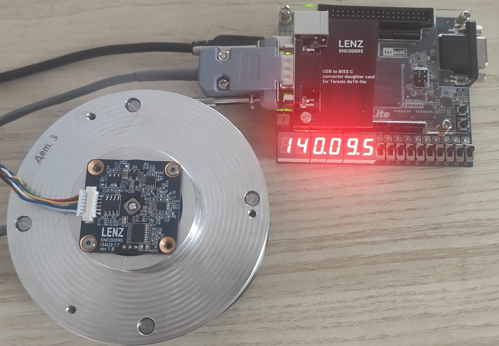

<!--
*** LENZ Encoders
-->

# Terasic DE10-Lite Board for LENZ Encoders

[Project](https://github.com/lenzencoders/BISS-C/tree/main/DE10-Lite) for Terasic DE10-Lite board.

 
 

And application to read BiSS data and upload calibration table:

 
 

Resources:
* [Terasic DE10-Lite board](https://www.terasic.com.tw/cgi-bin/page/archive.pl?Language=English&No=1021)
* [LENZ Daughter board for Terasic DE10-Lite](https://oshwlab.com/kmrost/de10-lite-biss-c-usb)
* [CH340 USB COM port driver](http://wch-ic.com/downloads/CH341SER_EXE.html)
* [Quartus project files](https://github.com/lenzencoders/BISS-C/tree/main/DE10-Lite/Quartus)
* [LENZ uploader tool](https://github.com/lenzencoders/BISS-C/tree/main/DE10-Lite/lenz_uploader)

(<a href="#top">back to top</a>)

# More Information

[View the encoders description and specifications](https://github.com/lenzencoders/Encoders_Description/blob/main/IRS-encoders_en_US.pdf).

<!-- CONTACT -->
# Contact

LENZ Encoders — info@lenzencoders.com \
Website — https://lenzencoders.com

(<a href="#top">back to top</a>)

