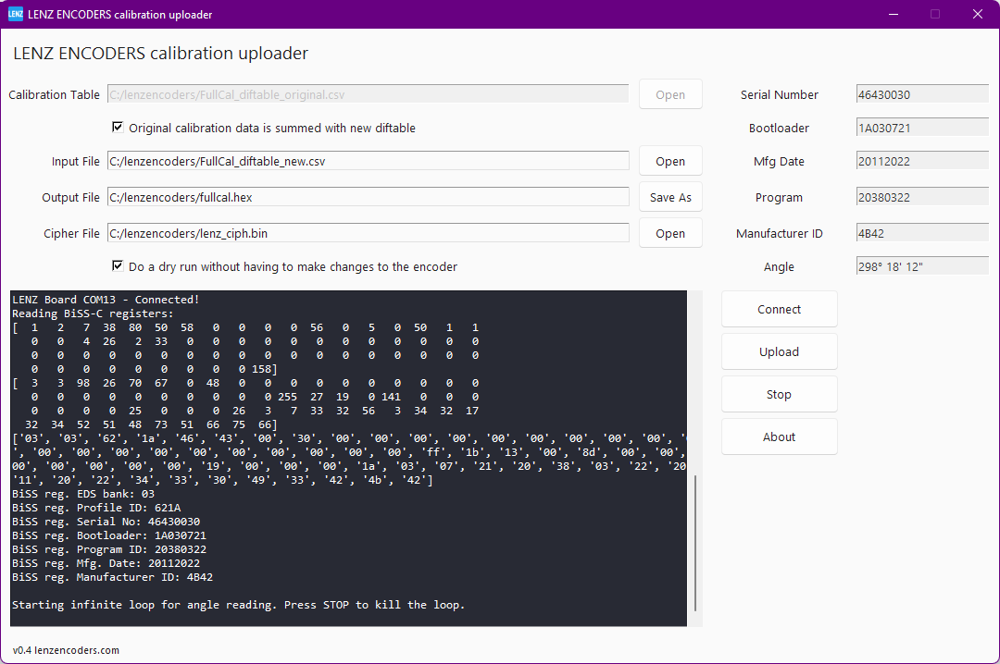

<div id="top"></div>
<!--
*** LENZ Encoders
-->

<!-- PROJECT LOGO -->
<br />
<div align="center">
  <a href="https://github.com/lenzencoders">
    
  </a>

  <h3 align="center">LENZ Encoders</h3>

  <p align="center">
    Miniature high-quality precise angle encoders
    <br />
    <a href="https://github.com/lenzencoders"><strong>Explore LENZ Encoders repositories »</strong></a>
    <br />
    <a href="https://lenzencoders.com"><strong>Visit LENZ Encoders website»</strong></a>
    <br />
    <br />
    <a href="https://github.com/lenzencoders/Encoders_Description/blob/main/IRS-encoders_en_US.pdf">View the encoders description and specifications</a>
    ·
    <a href="https://github.com/lenzencoders/Encoders_Description/issues">Report Bug</a>
    ·
    <a href="https://github.com/lenzencoders/Encoders_Description/issues">Request Feature</a>
  </p>
</div>

# LENZ Uploader

This is frontend tool for [LENZ Daughter board](https://github.com/lenzencoders/BISS-C/tree/main/DE10-Lite) for Terasic DE10-Lite board. It allows you:
* to upload calibration data
* to display BiSS registers
* to display current angle position

<a href="https://github.com/lenzencoders">
    
</a>
<br />
<br />

To run the app for the first time, just install required modules. For example, under the Windows do the following steps:

```sh
py -m venv venv
.\venv\Scripts\activate
pip install -r requirements.txt
```
Then run 
```sh
py lenz_uploader.py
```

Or, to compile, change `command_to_run` to point to exe file and change interpertor to `r''` in the `lenz_uploader.py` file:
```python
command_to_run = r'lenz_calibration_encrypt.exe'
# command_to_run = r'lenz_calibration_encrypt.py'
interpretor = r''
# interpretor = r'python -u'
```
And then compile with `pyinstaller`:
```sh
pyinstaller --onefile -w --icon favicon.ico .\lenz_calibration_encrypt.py
pyinstaller --onefile --collect-data sv_ttk --icon favicon.ico .\lenz_uploader.py
```


<p align="right">(<a href="#top">back to top</a>)</p>

# More Information

[View the encoders description and specifications](https://github.com/lenzencoders/Encoders_Description/blob/main/IRS-encoders_en_US.pdf).

<!-- CONTACT -->
# Contact

LENZ Encoders — info@lenzencoders.com \
Website — https://lenzencoders.com

<p align="right">(<a href="#top">back to top</a>)</p>

