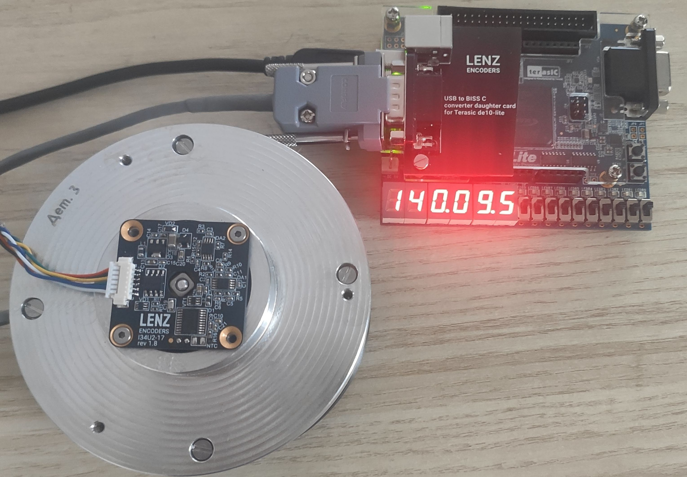

<div id="top"></div>
<!--
*** LENZ Encoders
-->

[![Contributors][contributors-shield]][contributors-url]
[![Forks][forks-shield]][forks-url]
[![Stargazers][stars-shield]][stars-url]
[![Issues][issues-shield]][issues-url]
[![MIT License][license-shield]][license-url]


<!-- PROJECT LOGO -->
<br />
<div align="center">
  <a href="https://github.com/lenzencoders">
    
  </a>

  <h3 align="center">LENZ Encoders</h3>

  <p align="center">
    Miniature high-quality precise angle encoders
    <br />
    <a href="https://github.com/lenzencoders"><strong>Explore LENZ Encoders repositories »</strong></a>
    <br />
    <a href="https://lenzencoders.com"><strong>Visit LENZ Encoders website»</strong></a>
    <br />
    <br />
    <a href="https://github.com/lenzencoders/Encoders_Description/blob/main/IRS-encoders_en_US.pdf">View the encoders description and specifications</a>
    ·
    <a href="https://github.com/lenzencoders/Encoders_Description/issues">Report Bug</a>
    ·
    <a href="https://github.com/lenzencoders/Encoders_Description/issues">Request Feature</a>
  </p>
</div>


<!-- TABLE OF CONTENTS -->
<!-- <details> -->
<summary>Table of Contents</summary>
<ol>
  <li><a href="#about-the-encoders">About the Encoders</a></li>
  <li><a href="#biss-c-and-connection">BiSS C and Connection</a></li>
  <li><a href="#terasic-de10-lite-board-for-lenz-encoders">Terasic DE10-Lite Board for LENZ Encoders</a></li>
  <li><a href="#servo-drive-templates">Servo Drive Templates</a>
    <ul>
      <li><a href="#elmo-motion-control">ELMO Motion Control</a></li>
      <li><a href="#ingenia-servo-drive">INGENIA Servo Drive</a></li>
    </ul>
  </li>
    
  <li><a href="#tests-results">Tests Results</a>
    <ul>
      <li><a href="#maximum-operating-speed-of-the-encoders">Maximum Operating Speed of the Encoders</a></li>
    </ul>
  </li>
  <li><a href="#more-information">More Information</a></li>
  <li><a href="#contact">Contact</a></li>
</ol>
<!-- </details> -->


<!-- ABOUT THE ENCODERS -->
# About the Encoders
LENZ Encoders are non-contact bearingless absolute angle encoders. Two printed circuit board design is perfect to match wide variety of control and measurements applications with limited space. Precise position data up to 22 bits and reliable fast feedback in harsh environments.

LENZ encoders are inductive position sensors based on the physical principles of electromagnetic induction. Our encoders combine easy installation, low integration cost, high accuracy, stability over time, are extremely robust.

LENZ encoders are insensitive to electromagnetic fields, permanent magnets, power lines, parasitic capacitance, metallic parts and electrical noises.

<br />

<span style="display:block;text-align:center">[![LENZ Encoders IRS-I34 photo][product-photo]](https://lenzencoders.com)</span>

<p align="right">(<a href="#top">back to top</a>)</p>


# BiSS C and Connection

Please refer to papers provided:

* [BiSS C paper](https://github.com/lenzencoders/BISS-C/blob/main/BISS%20C_B3%20description.pdf)
* [Electrical connection paper](https://github.com/lenzencoders/BISS-C/blob/main/Electrical%20Connection.pdf)

<p align="right">(<a href="#top">back to top</a>)</p>


# Terasic DE10-Lite Board for LENZ Encoders

[Project](https://github.com/lenzencoders/BISS-C/tree/main/DE10-Lite) for Terasic DE10-Lite board.

<a href="https://github.com/lenzencoders">
    
</a>
<br />
<br />

And application to read BiSS data and upload calibration table:
<a href="https://github.com/lenzencoders">
    
</a>
<br />
<br />


Resources:
* [Terasic DE10-Lite board](https://www.terasic.com.tw/cgi-bin/page/archive.pl?Language=English&No=1021)
* [LENZ Daughter board for Terasic DE10-Lite](https://oshwlab.com/kmrost/de10-lite-biss-c-usb)
* [CH340 USB COM port driver](http://wch-ic.com/downloads/CH341SER_EXE.html)
* [Quartus project files](https://github.com/lenzencoders/BISS-C/tree/main/DE10-Lite/Quartus)
* [LENZ uploader tool](https://github.com/lenzencoders/BISS-C/tree/main/DE10-Lite/lenz_uploader)


<p align="right">(<a href="#top">back to top</a>)</p>

# Servo Drive Templates

## ELMO Motion Control

ELMO controller feedback filters settings for LENZ Encoders:

<a href="https://github.com/lenzencoders/BISS-C/raw/main/TEMPLATES/ELMO%20BISS%20C%20feedback%20filters%20settings.png">
    
</a>
<br />
<br />

ELMO controller BiSS Cfeedback settings for LENZ Encoders:

<a href="https://github.com/lenzencoders/BISS-C/raw/main/TEMPLATES/ELMO%20BISS%20C%20feedback%20settings.png">
    
</a>
<br />
<br />

<p align="right">(<a href="#top">back to top</a>)</p>


## INGENIA Servo Drive
```
Protocol → 0 (BiSS-C)
Frame size → 32
Frame type → 3 (BISS-C BP3) // or Frame type → 0 (raw) 
Position bits → 17	// = Encoder Resolution
Single-turn bits → 17 // = Position bits
Position start bit →  15 // = Frame size - Position bits
Baudrate → 5000 kbits/s
Wait cycles → 0
```


<p align="right">(<a href="#top">back to top</a>)</p>

# Tests Results

## Maximum Operating Speed of the Encoders

IRS-I34 encoders showed ability to provide stable output at the speed up to 38000 RPM. 
* One can dive into [output data of IRS-I34](https://github.com/lenzencoders/BISS-C/blob/main/TEST/LENZ_IRS_34U2S1-17_max_speed_test_38krpm.zip).
* Also we have a [📹 Video](https://www.youtube.com/watch?v=S2KUlJbIPas) of the speed test.


<p align="right">(<a href="#top">back to top</a>)</p>

# More Information

[View the encoders description and specifications](https://github.com/lenzencoders/Encoders_Description/blob/main/IRS-encoders_en_US.pdf).

<!-- CONTACT -->
# Contact

LENZ Encoders — info@lenzencoders.com \
Website — https://lenzencoders.com

<p align="right">(<a href="#top">back to top</a>)</p>

<!-- MARKDOWN LINKS & IMAGES -->
<!-- https://www.markdownguide.org/basic-syntax/#reference-style-links -->
[contributors-shield]: https://img.shields.io/github/contributors/lenzencoders/Encoders_Description.svg?style=for-the-badge
[contributors-url]: https://github.com/lenzencoders/graphs/contributors
[forks-shield]: https://img.shields.io/github/forks/lenzencoders/Encoders_Description.svg?style=for-the-badge
[forks-url]: https://github.com/lenzencoders/network/members
[stars-shield]: https://img.shields.io/github/stars/lenzencoders/Encoders_Description.svg?style=for-the-badge
[stars-url]: https://github.com/lenzencoders/stargazers
[issues-shield]: https://img.shields.io/github/issues/lenzencoders/Encoders_Description.svg?style=for-the-badge
[issues-url]: https://github.com/lenzencoders/issues
[license-shield]: https://img.shields.io/github/license/lenzencoders/Encoders_Description.svg?style=for-the-badge
[license-url]: https://github.com/lenzencoders/blob/master/LICENSE.txt
[linkedin-shield]: https://img.shields.io/badge/-LinkedIn-black.svg?style=for-the-badge&logo=linkedin&colorB=555
[linkedin-url]: https://linkedin.com/in/lenzencoders
[product-photo]: images/irs-i34_white_c.jpg